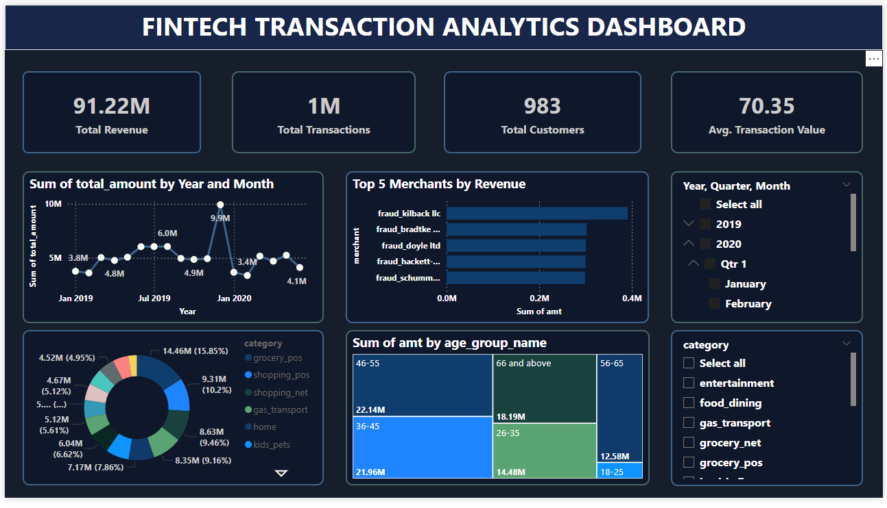

Project: Credit Card Transactions Data Warehouse

Mô tả ngắn gọn:

Thiết kế và triển khai Data Warehouse phân tích dữ liệu giao dịch thẻ tín dụng sử dụng dataset công khai từ Kaggle, nhằm hỗ trợ báo cáo KPI đa chiều như tổng doanh thu theo thời gian, phân tích theo nhóm tuổi khách hàng và theo loại giao dịch.

Key Responsibilities:

Chuẩn hóa dữ liệu thô và xây dựng quy trình ETL để load dữ liệu từ nguồn tập tin CSV vào hệ thống kho dữ liệu.

Thiết kế mô hình dữ liệu star schema với bảng fact_transaction, fact_merchant và các bảng dimension như dim_time, dim_customer, dim_category, dim_merchant, dim_age_group.

Xây dựng logic phân nhóm tuổi (age groups) và ánh xạ các khóa thay thế (surrogate keys) cho các bảng dimension để đảm bảo tính nhất quán và hiệu quả query.

Tối ưu hóa mô hình để phục vụ các báo cáo phân tích doanh thu theo tháng, phân khúc hành vi khách hàng theo nhóm tuổi, và phân tích chi tiêu theo loại giao dịch.

Thiết lập quan hệ giữa fact và dimension trong Power BI để hỗ trợ trực quan hóa dữ liệu.

Triển khai dashboard trong Power BI để thể hiện các insight như: trend doanh thu theo thời gian, top nhóm chi tiêu, phân bố theo độ tuổi.

Mô hình Star-Schema khi load dữ liệu lên POWER BI

Trực quan hóa dữ liệu- tạo dashboard trên POWER BI

